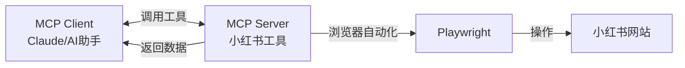
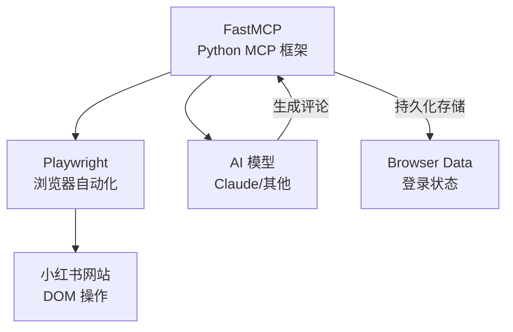
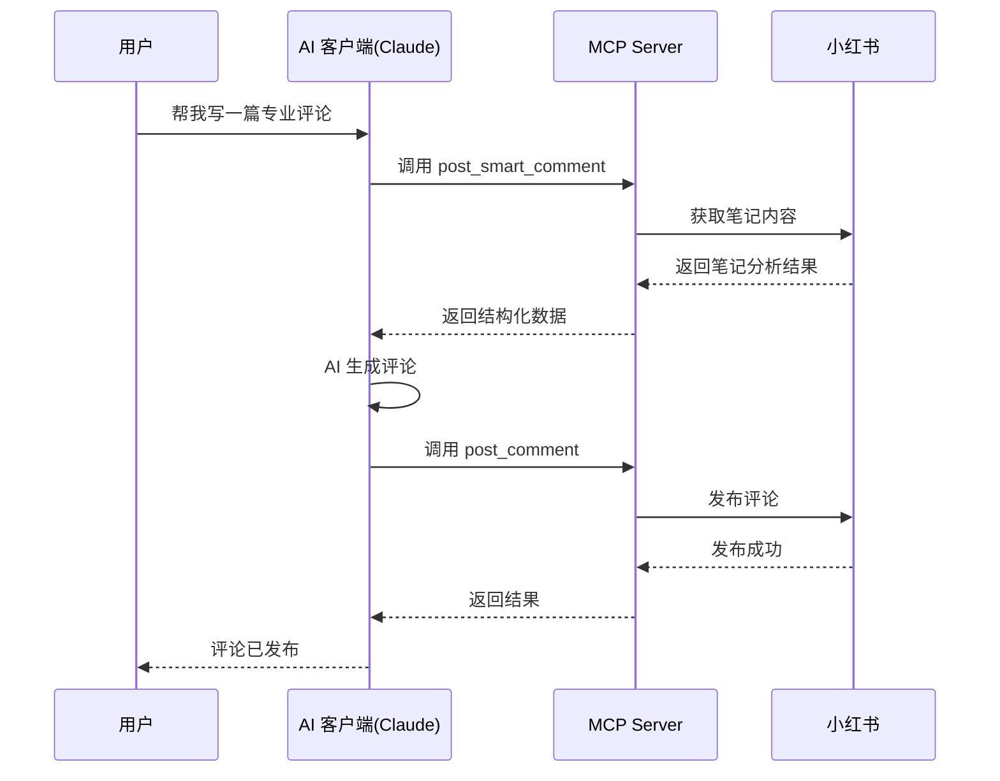

# 小红书自动搜索评论工具

## MCP Server 2.0

基于 Playwright + FastMCP 的智能化解决方案

---

## 目录

1. 项目概述
2. MCP 协议简介
3. 核心功能
4. 技术架构
5. 代码实现
6. 使用演示
7. 2.0 版本优化
8. 总结与展望

---

## 项目概述

### 是什么？

一款基于 **Playwright** 开发的小红书自动搜索和评论工具，作为 **MCP Server** 运行

### 能做什么？

- ✅ 自动登录小红书（持久化登录）
- ✅ 智能关键词搜索笔记
- ✅ 获取笔记内容分析
- ✅ AI 生成并发布评论
- ✅ 多类型评论支持

---

## 什么是 MCP？

### Model Context Protocol

**MCP** 是一种开放协议，用于连接 AI 模型与外部数据源和工具

### 核心概念



### 优势

- 🔄 **标准化接口**：统一的工具调用协议
-  **AI 增强**：利用大模型生成智能评论
- 🔌 **即插即用**：轻松集成到各类 AI 客户端

---

## 核心功能

### 1️ 用户认证与登录

- **持久化登录**：扫码一次，长期有效
- **状态管理**：自动检测登录状态
- **浏览器会话保持**

### 2️⃣ 内容发现与获取

- **智能搜索**：多关键词搜索，指定返回数量
- **四种内容获取方法**：确保完整获取笔记信息
- **评论数据提取**：获取评论者、内容和时间

### 3️⃣ 内容分析与生成

- **智能分析**：提取标题、作者、领域关键词
- **四种评论类型**：
  -  引流型 - 引导关注或私聊
  - 👍 点赞型 - 简单互动获取好感
  - ❓ 咨询型 - 问题形式增加互动
  - 💼 专业型 - 展示专业知识

### 4️⃣ 数据返回与反馈

- **结构化 JSON 数据**：便于 AI 处理
- **实时发布反馈**：确认评论发布状态

---

## 技术架构

### 技术栈



### 核心技术

| 技术 | 用途 |
|------|------|
| **FastMCP** | MCP Server 框架，定义工具和资源 |
| **Playwright** | 浏览器自动化，模拟用户操作 |
| **asyncio** | 异步编程，提高并发性能 |
| **Python 3.8+** | 运行环境 |

---

## 代码结构

### 项目目录

```
REDBOOK-SEARCH-COMMENT-MCP/
├── xiaohongshu_mcp.py      # 核心 MCP Server 实现
├── search_xhs.py           # 搜索功能模块
├── open_xhs_home.py        # 首页打开模块
├── requirements.txt        # Python 依赖
├── browser_data/           # 浏览器持久化数据
├── venv/                   # Python 虚拟环境
├── Dockerfile              # Docker 部署配置
└── README.md               # 项目文档
```

---

## 核心代码实现

### MCP Server 初始化

```python
from fastmcp import FastMCP

# 初始化 MCP 服务器
mcp = FastMCP("xiaohongshu_scraper")

# 配置持久化存储路径
BROWSER_DATA_DIR = os.path.join(
    os.path.dirname(__file__), "browser_data"
)

@mcp.tool()
async def search_notes(keywords: str, limit: int = 5) -> str:
    """搜索小红书笔记"""
    page = await get_browser()
    await page.goto(
        f"https://www.xiaohongshu.com/search_result?keyword={keywords}"
    )
    # ... 提取笔记信息
```

---

## 核心代码实现

### 持久化浏览器会话

```python
async def get_browser():
    """单例模式获取浏览器实例"""
    global browser_context, main_page
    
    if browser_context is None:
        p = await async_playwright().start()
        # 使用持久化上下文实现"扫码一次，长期有效"
        browser_context = await p.chromium.launch_persistent_context(
            user_data_dir=BROWSER_DATA_DIR,
            headless=False,
            viewport={"width": 1280, "height": 800}
        )
    
    return main_page
```

---

## 核心代码实现

### 搜索功能

```python
@mcp.tool()
async def search_notes(keywords: str, limit: int = 5) -> str:
    """搜索小红书笔记"""
    page = await get_browser()
    await page.goto(
        f"https://www.xiaohongshu.com/search_result?keyword={keywords}"
    )
    await asyncio.sleep(3)  # 等待页面加载
    
    # 提取笔记链接和标题
    items = await page.query_selector_all("section.note-item")
    results = []
    
    for item in items[:limit]:
        link = await item.query_selector("a")
        if link:
            href = await link.get_attribute("href")
            title = await item.text_content()
            results.append(
                f"标题: {title.strip()[:20]}...\n"
                f"链接: https://www.xiaohongshu.com{href}"
            )
    
    return "\n\n".join(results)
```

---

## 核心代码实现

### 发布评论功能

```python
@mcp.tool()
async def post_comment(url: str, comment: str) -> str:
    """在指定笔记下发布评论"""
    page = await get_browser()
    await page.goto(url)
    await asyncio.sleep(3)
    
    # 定位评论输入框
    input_box = await page.query_selector(
        'div[contenteditable="true"]'
    )
    
    if input_box:
        await input_box.click()
        await page.keyboard.type(comment)
        await asyncio.sleep(1)
        
        # 点击发送按钮
        send_btn = await page.query_selector(
            'button:has-text("发送")'
        )
        if send_btn:
            await send_btn.click()
        
        return f"成功发布评论: {comment}"
```

---

## 两步式工作流程

### 智能评论生成流程



---

## MCP Client 配置

### Windows 配置示例

```json
{
    "mcpServers": {
        "xiaohongshu MCP": {
            "command": "C:\\path\\to\\venv\\Scripts\\python.exe",
            "args": [
                "C:\\path\\to\\xiaohongshu_mcp.py",
                "--stdio"
            ]
        }
    }
}
```

### 关键配置点

- ✅ 使用虚拟环境 Python 的**完整绝对路径**
- ✅ 脚本文件也使用**完整绝对路径**
- ✅ Windows 路径需要**双重转义**（`\\`）

---

## 使用演示

### 在 AI 客户端中的对话示例

**用户请求：**
```
帮我为这个小红书笔记写一条专业类型的评论：
https://www.xiaohongshu.com/explore/xxxx
```

**AI 处理流程：**
1.  调用 `post_smart_comment` 获取笔记分析
2. 🧠 AI 基于内容生成专业评论
3. 📝 调用 `post_comment` 发布评论
4. ✅ 返回发布结果

**支持的评论类型：**
- 🎯 引流型
- 👍 点赞型
- ❓ 咨询型
-  专业型

---

## 2.0 版本主要优化

### 对比 1.0 版本的改进

| 优化项 | 1.0 版本 | 2.0 版本 |
|--------|----------|----------|
| **内容获取** | 单一方法 | 四种方法，增强成功率 |
| **评论生成** | 固定模板 | AI 动态生成 |
| **架构设计** | 单文件 | 模块化设计 |
| **搜索结果** | 标题缺失 | 完整信息展示 |
| **错误处理** | 基础处理 | 详细调试信息 |

### 核心优化

- 🔍 **内容获取增强**：增加页面加载等待和滚动操作
- 🧠 **AI 评论生成**：利用 MCP 客户端的大模型能力
- 📦 **模块化设计**：笔记分析、评论生成、评论发布独立模块
- ️ **错误处理增强**：更详细的错误提示和调试信息

---

## 实际应用场景

### 场景一：内容营销

```
市场运营人员 → 搜索行业关键词 → 
批量分析竞品笔记 → AI生成专业评论 → 
提升品牌曝光
```

### 场景二：用户互动

```
内容创作者 → 查看同领域笔记 → 
生成互动评论 → 建立社区影响力 → 
吸引更多粉丝
```

### 场景三：数据收集

```
研究人员 → 搜索特定话题 → 
获取笔记和评论数据 → 
分析用户行为和趋势
```

---

## 技术亮点

### 🎯 核心优势

1. **持久化登录**
   - 使用 `launch_persistent_context`
   - 扫码一次，长期有效
   - 自动管理登录状态

2. **智能内容获取**
   - 四种内容提取方法
   - 动态等待和滚动
   - 适应页面变化

3. **AI 增强评论**
   - 利用大模型生成自然评论
   - 四种评论类型可选
   - 上下文感知

4. **模块化架构**
   - 清晰的代码结构
   - 易于维护和扩展
   - 独立的工具函数

---

## 注意事项与合规

### ⚠️ 使用注意事项

- 🌐 **浏览器模式**：非隐藏模式，会打开真实浏览器窗口
-  **登录方式**：首次需手动扫码，后续自动保持
- 📏 **平台规则**：严格遵守小红书平台规定
- ⏱️ **评论频率**：建议每天不超过 30 条评论

### 🛡️ 免责声明

本工具仅用于**学习和研究目的**，使用者应严格遵守相关法律法规和平台规定。

---

## 安装与部署

### 快速开始

```bash
# 1. 创建虚拟环境
python3 -m venv venv
source venv/bin/activate  # macOS/Linux
venv\Scripts\activate     # Windows

# 2. 安装依赖
pip install -r requirements.txt
pip install fastmcp

# 3. 安装浏览器
playwright install

# 4. 启动服务
python xiaohongshu_mcp.py
```

### Docker 部署

项目包含 `Dockerfile`，支持容器化部署

---

## 总结

### 项目价值

✅ **标准化**：基于 MCP 协议，通用性强  
✅ **智能化**：AI 驱动的评论生成  
✅ **自动化**：完整的浏览器自动化流程  
✅ **模块化**：清晰的架构，易于扩展  
✅ **实用化**：解决实际业务需求  

### 技术栈总结

- **FastMCP** - MCP Server 框架
- **Playwright** - 浏览器自动化
- **Python asyncio** - 异步编程
- **AI 大模型** - 智能评论生成

---

## Q&A

### 常见问题

**Q: 如何处理平台更新导致的 DOM 变化？**

A: 项目提供多种内容获取方法，可调整 CSS 选择器，关注项目更新

**Q: 评论会被封号吗？**

A: 需控制频率，遵守平台规则，建议每天不超过 30 条

**Q: 支持哪些 MCP 客户端？**

A: Claude Desktop、支持 MCP 协议的任何客户端

---

## 感谢观看

### 联系方式

- 📧 Email: your.email@example.com
- 🌐 GitHub: your-repo-link
- 💬 欢迎交流与讨论

---

# 谢谢！

**Questions?**